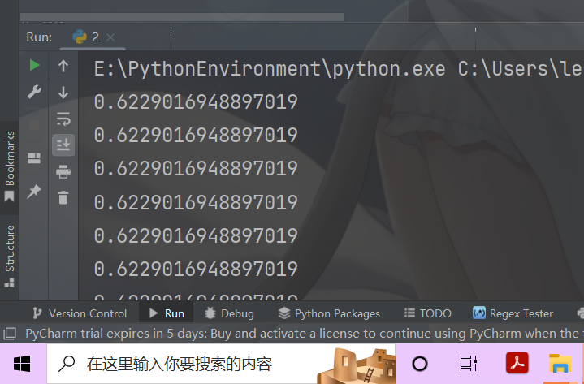

# 考试结构

## 选择题

- 10道公共知识

  什么二叉树、数据结构、栈啥的。建议考前五天看一个视频就可以了。

  考试带笔，要监考老师的草稿纸。

- 30道```python```选择题

  概念题、脑壳跑代码...

## 基本操作三道

- 打印字符串
- 一般是基本知识，比如说列表啊，range啊
- ```random```库

## 简单应用两道

- ```turtle```库
- 读文件跑代码或比较基础的东西

## 综合运用

- 应该是有手就行

# 基本操作

## 1 字符串

```format()```方法

> 键盘输入正整数n，按要求把n输出到屏幕，格式要求:宽度为20个字符，减号字符-填充，右对齐，带千位分隔符。

- 语法格式

  ```python
  print('{:[仅有一个填充的字符，不指定则默认是用空格][^居中/<左对齐/>右对齐][宽度][,][.精度][类型])}'.format(num)
  ```

- 举个例子

  ```python
  print("我叫{}，今年{}岁。".format("发发", 2))
  # 亦可使用关键词
  print("我叫{name}，{name}今年{grade}年级。".format(name="发发", grade=5))  # 了解
  ```

- 要考的

  ```python
  # 格式化数字(记得有:)
  print("{:.5f}".format(3.14))  # 保留小数点
  print("{:.0f}".format(3.14))  # 不保留
  print("{:+.1f}".format(3.14))  # 带符号
  
  # 格式化对齐
  print("{:->20,}".format(2500))
  ---------------2,500
  # 保留小数点
  print("{:->20,.5f}".format(2500))
  ---------2,500.00000
  # 不要三位一分割
  print("{:->20}".format(2500))
  ----------------2500
  # 居中
  print("{:-^20,}".format(2500))
  -------2,500--------
  ```

## 2 random 库

- 随机数

  ```python
  random.random()
  ```

- 随机整数

  ```python
  random.randint(a, b)
  ```

  ```python
  help(random.randint)
  Help on method randint in module random:
  
  randint(a, b) method of random.Random instance
      Return random integer in range [a, b], including both end points.
  ```

- 随机数种子

  ```python
  random.seed(int)
  ```

  > 以100为随机数种子，随机生成3个在1(含)到9(含)之间的随机整数，计算这三个随机整数的立方和。

  举个栗子

  ```python
  import random
  
  while True:
      random.seed(5)
      print(random.random())
  ```

  

- 随机选择

  ```python
  random.choice([123, 456, 789, '不要选我不要选我'])
  ```

## 3 time 库


## 3 turtle 库


## 4 jieba 库


